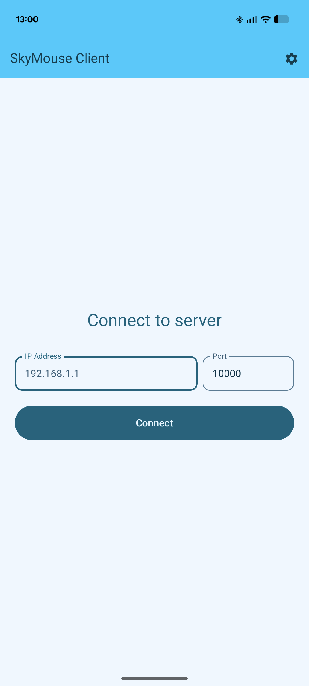
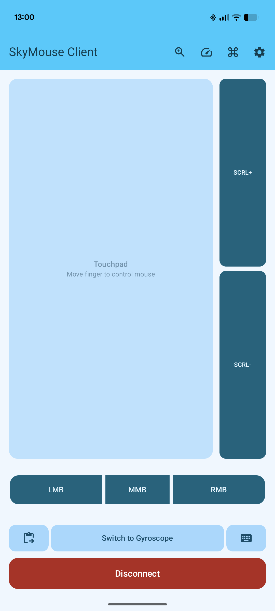
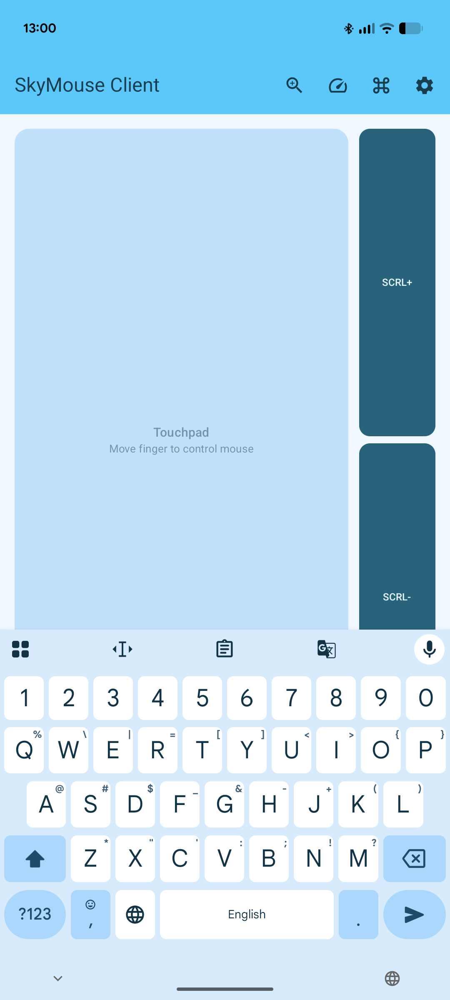
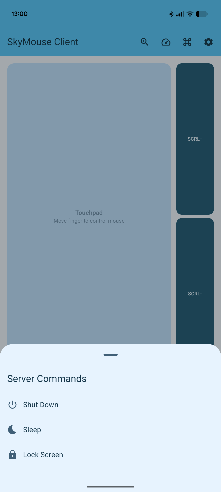
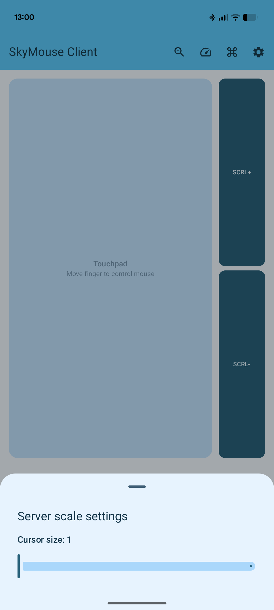
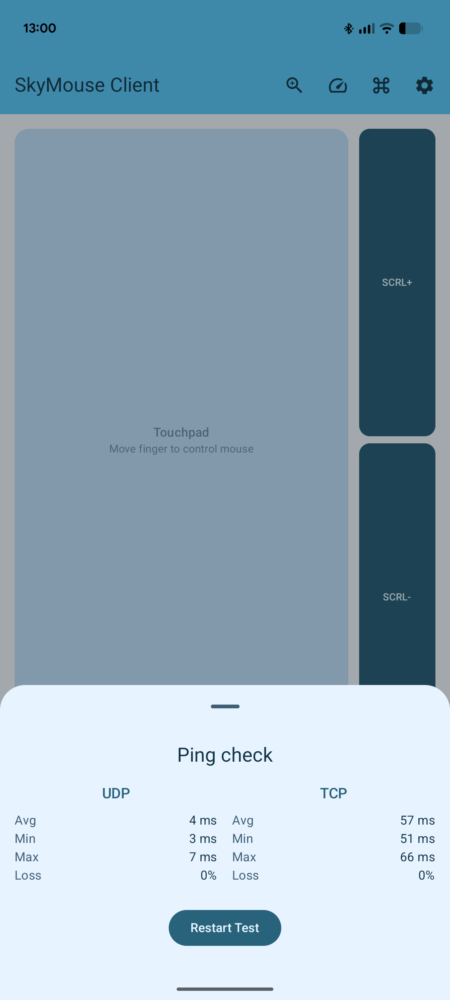
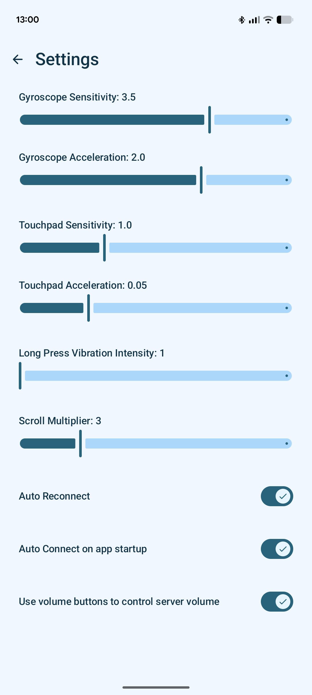

# SkyMouse
<p align="center">
  
</p>

<p align="center">
  
  
  
  
  
  
  
</p>


## How to startup the server
create config.yaml file near of the server.exe  
config fields:  
``` yaml
server_ip: "" # put the mashine IP or "" to listen all interfaces (not required field)
tcp_port: 10000 # port to connect to the server (required field)
log_path: "skymouse.log" # path to the log file (not required field)
```

---

### Server startup flags
`--help` — Print auto-generated help for all flags  
`-lf` — Enable log to a file  
`--config` — Path to the YAML config file  
`--version` — Print Protobuf contract version

#### Command to generate proto for Kotlin & Go  
run in repo root:  
```sh
protoc --proto_path=proto \
--go_out=pc/pkg/protoapi \
--go_opt=paths=source_relative \
--java_out=android/app/src/main/java \
--kotlin_out=android/app/src/main/java \
proto/skymouse.proto
```
